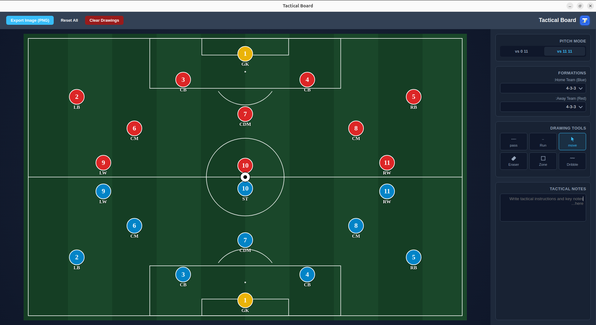

<div align="center">

  

  <h1>Tactical Board</h1>

  <h3>A desktop app for planning football tactics and formations</h3>

</div>

Draw formations on a football pitch, move players around, and sketch out plays with arrows, passes, and zones — built for coaches and analysts who want a quick, visual way to plan and share tactics.



## Features

- Ready-made formations (4-3-3, 4-2-3-1, 4-4-2, 3-5-2, 4-1-4-1, 5-3-2) for one or two teams
- Drag and drop players anywhere on the pitch
- Edit each player's number and name/role
- Drawing tools: pass, run, dribble, zone, and eraser
- A notes box for writing down tactics and key points
- Export the board as a PNG image to share

## Installation

**Build it yourself** (any OS, requires [Node.js](https://nodejs.org)):
```bash
git clone https://github.com/BandarALThobaiti/tactical-board.git
cd tactical-board
npm install
npm start
```

**Windows / macOS / Linux** — the steps above work the same on all three. Just make sure Node.js is installed first ([nodejs.org](https://nodejs.org), LTS version).

> Linux note: if the app crashes on start (`SIGSEGV` or similar), try a more stable Electron version:
> ```bash
> npm install --save-dev electron@30
> ```

## License

MIT License — see [LICENSE](LICENSE).